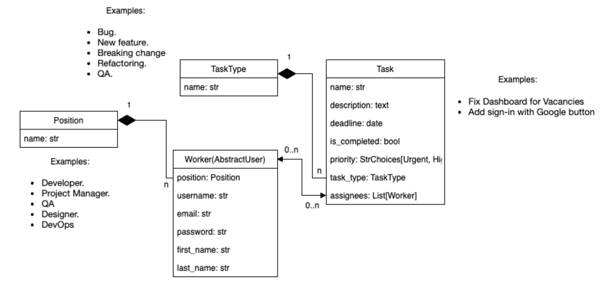
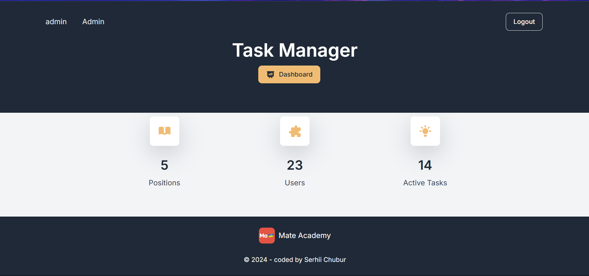

Task Manager

## Introduction

**Task Manager** is a comprehensive tool designed to enhance task management for 
IT professionals, including developers, designers, project managers, and 
QA specialists. It enables teams to create tasks, assign them to members, 
and track progress in a streamlined manner. The tool helps teams stay organized, 
meet deadlines, and improve collaboration. 
Task Manager offers both essential and advanced features to support a wide 
range of workflows.

---

## Table of Contents

- [Features](#features)
- [Usage](#usage)
- [Dependencies](#dependencies)
- [Demo](#demo)

---

## Features

- **Task Management**:
  - Create tasks with detailed descriptions and deadlines.
  - Assign tasks to specific team members.
  - Mark tasks as completed.

- **Team Collaboration**:
  - View tasks assigned to individual members.
  - Track completed and pending tasks for each team member.
    

## Usage

1. Navigate to the application in your web browser at [http://localhost:8000](http://localhost:8000).
2. **Sign Up**: Register as a user and log in.
3. **Create a Team**:
   - Add team members by sending them invite links or creating their profiles.
4. **Manage Tasks**:
   - Create tasks and assign them to specific team members.
   - Use tags to categorize tasks for better organization.
5. **Track Progress**:
   - View tasks assigned to you or your team.
   - Mark tasks as completed once done.

### User Roles
- **Team Members**: Create and manage tasks.
- **Admins**: Manage teams and assign projects.
- **Project Managers**: Oversee projects and track progress.

## Dependencies

### Backend
- [Django](https://www.djangoproject.com/) (Core framework)

### Frontend (Optional)
- [Bootstrap](https://getbootstrap.com/) (For responsive UI design).

### Demo
